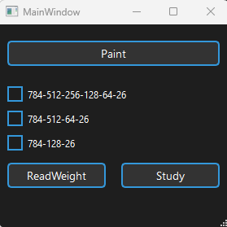

# Нейронная сеть типа многослойный перцептрон (MLP) на C++ с использованием Qt Creator

Этот проект - реализация нейронной сети типа многослойный перцептрон на языке C++ с использованием фреймворка Qt Creator. Нейронная сеть позволяет выбирать конфигурацию сети (количество слоев и нейронов на каждом слое) и распознавать рукописные символы, введенные пользователем.

## Особенности проекта

- Использует многослойный перцептрон для распознавания рукописных слов.
- Имеет графический интерфейс пользователя (GUI), разработанный с использованием Qt Creator.
- Пользователь может выбирать конфигурацию нейронной сети перед запуском.
- Поддерживает вставку изображения с рукописными словами или рисование слов в окне программы.

## Требования к системе

- Qt Creator: для разработки графического интерфейса.
- Компилятор C++: для сборки и запуска проекта.

## Примеры использования
- При запуске приложения есть возможность загрузить уже готовые веса, а также поставить нейронную сеть на обучение на предоставленных данных.
- Есть возможность выбрать три разных конфигурации нейронной сети:

  - 784-512-256-128-64-26
  - 784-512-64-26
  - 784-128-26

  

- После загрузки весов есть два выбора:
  - Загрузить файл с рукописными словами
  - Написать несколько слов в предоставленном окне
  

    
  

  

    
  

- После загрузки слов любым из предоставленных способах программа сразу выдаст результат.
  

  
  

